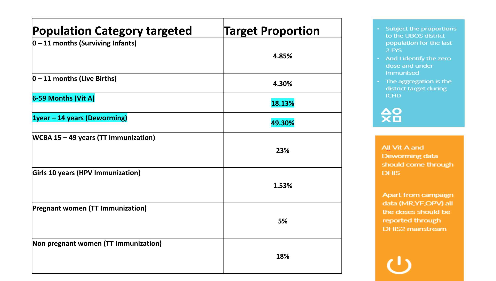

<!-- README.md is generated from README.Rmd. Please edit that file -->

# UNEPItargets

<!-- badges: start -->

[](https://github.com/amanyiraho/UNEPItargets/actions/workflows/R-CMD-check.yaml)
<!-- badges: end -->

The goal of UNEPItargets is to provide tools for the computations below;



## Installation

You can install the development version of UNEPItargets from
[GitHub](https://github.com/) with:

``` r
# install.packages("devtools")
devtools::install_github("amanyiraho/UNEPItargets")
```

## Example

This is a basic example which shows you compute some common target
populations

Load package

``` r
library(UNEPItargets)
```

Get some population data

``` r
## install the UBOSpopulation package for UBOS population estimates dataset
#devtools::install_github("amanyiraho/UBOSpopulation")

library(UBOSpopulation)
library(dplyr)
```

``` r
## filter out 2023 district level data
uganda_population_2023 <- population_estimates |>
  filter(lower_local_government == "District_level"&
           categroy == "total",
         year == 2023) |>
  select(district_city, population)

head(uganda_population_2023)
#> # A tibble: 6 × 2
#>   district_city population
#>   <fct>              <dbl>
#> 1 Buhweju           156900
#> 2 Buliisa           171300
#> 3 Bundibugyo        285000
#> 4 Bushenyi          254200
#> 5 Hoima City        135300
#> 6 Hoima             277800
```

Get the national population estimate

``` r
uganda_total_population <- sum(uganda_population_2023$population)
uganda_total_population
#> [1] 45508000
```

#### Live births

``` r
live_births_0_11m(uganda_total_population)
#> [1] 2207138
```

#### Surviving infants

``` r
surviving_infants_0_11m(uganda_total_population)
#> [1] 1956844
```

#### Girls 10 years

``` r
girls_10y(uganda_total_population)
#> [1] 696273
```
